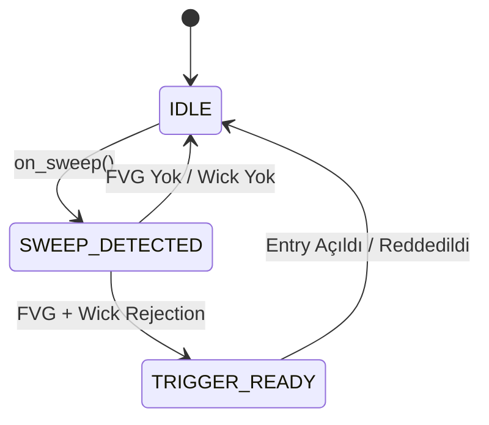

# Sniper Backtest Stratejisi — Veri Akışı ve Mimari

## Genel Bakış

Strateji, **CBDR (Central Bank Decision Range)** bazlı likidite sweep tespiti ile **FVG (Fair Value Gap)** wick rejection birleşimine dayanır. Gün içinde maksimum **2 işlem** açar: 1. entry (sinyal bazlı) + 2. entry (retrade, ters yön sweep bazlı).

---

## Veri Akış Şeması

```mermaid
flowchart TD
    A["1m CSV Veri<br/>113.647 bar"] --> B["15m Resample<br/>7.576 bar"]
    B --> C["CBDR Tracking<br/>22:00-02:00 UTC"]
    C --> D{"CBDR Locked?<br/>(02:00 UTC)"}
    D -->|Evet| E["Seans Boyunca Sweep Ara<br/>cbdr_body_high/low +/- tolerance"]
    E --> F{"Sweep Bulundu?"}
    F -->|Evet| G["RSM Feed<br/>RetraceStateMachine.on_sweep()"]
    G --> H["FVG Tara<br/>scan_htf_fvgs(lookback=100)"]
    H --> I{"Wick Rejection?<br/>wick FVG'ye dokundu,<br/>body kırmadı"}
    I -->|Evet| J["TRIGGER_READY"]
    J --> K["Bias Filtresi<br/>sweep yönü == daily_bias"]
    K --> L["NY Seans Filtresi<br/>13:00-22:00 UTC"]
    L --> M["SL/TP Hesapla<br/>SL=FVG edge + buffer<br/>TP=London High/Low veya 2R"]
    M --> N["1. Entry Aç<br/>trades_today=1"]
    
    N --> O["Trailing SL/TP<br/>Yeni FVG oluşunca<br/>SL ve TP birlikte kayar"]
    O --> P{"TP/SL Hit?"}
    P -->|SL veya TP| Q["1. Entry Kapandı<br/>trades_today=1"]
    
    Q --> R{"is_retrade=False<br/>&& trades_today==1<br/>&& retrade_armed=False"}
    R -->|Evet| S["Retrade Arm Et"]
    S --> T["Son 5 Bar'ın<br/>Highest High / Lowest Low'unu Hesapla"]
    T --> U{"Fiyat Bu Seviyeyi<br/>Sweep Etti mi?"}
    U -->|Evet| V["RSM Retrade Feed<br/>Ters Yön Sweep"]
    V --> W["FVG Tara + Wick Rejection"]
    W --> X{"Trigger Ready?"}
    X -->|Evet| Y["NY Seans Kontrolü"]
    Y --> Z["2. Entry Aç<br/>trades_today=2"]
    Z --> AA["Trailing SL/TP"]
    AA --> AB{"TP/SL Hit?"}
    AB -->|Evet| AC["2. Entry Kapandı<br/>Gün bitti, yeni CBDR beklenir"]

    F -->|Hayır| AD["Sonraki Bar'da Sweep Ara"]
    U -->|Hayır| AE["Sonraki 5 Bar'da Sweep Tara"]
```



---

## 1. Entry (Primary) Pipeline

### Adım Adım Akış

```
1m CSV → 15m Resample → CBDR Tracking → Sweep → FVG → Wick Rejection → Entry
```

| Aşama | Açıklama | Pipeline Sayacı |
|-------|----------|----------------|
| **CBDR Locked** | 22:00-02:00 UTC arası CBDR body high/low takibi, 02:00'de kilitlenir | `cbdr_locked=1166` |
| **Sweep Detected** | Fiyat cbdr_body_high üstüne çıkıp close altında kalırsa (bullish sweep) veya cbdr_body_low altına inip close üstünde kalırsa (bearish sweep) | `sweep_detected=252` |
| **RSM Feed** | Sweep bulununca RetraceStateMachine beslenir → state IDLE → SWEEP_DETECTED | `sweep_fed=252` |
| **FVG Scanned** | Son 100 bar taranır, HTF FVG'ler bulunur | `fvg_scanned=252` |
| **Wick Rejection** | Sweep bar'ının fitili FVG'ye dokunur ama body FVG'yi kırmaz | `wick_rejection=120` |
| **Trigger Ready** | FVG + wick rejection başarılı → LONG/SHORT sinyali hazır | `trigger_ready=120` |
| **Bias Filter** | Sweep yönü günlük bias ile uyumlu olmalı | `filter_bias=120` |
| **Session Filter** | Sadece NEWYORK seansında (13:00-22:00 UTC) işlem açılır | `filter_session=45` |
| **New Entry** | 75 işlem (3 aylık veride) | `new_entry=75` |

### SL/TP Hesabı

```
Long:
  SL = FVG.bottom - (risk_pts × 0.25)    // FVG altı + buffer
  TP = London High (varsa) veya entry + 2R

Short:
  SL = FVG.top + (risk_pts × 0.25)       // FVG üstü + buffer
  TP = London Low (varsa) veya entry - 2R
```

### Trailing SL/TP

Her yeni 15m bar'da FVG taranır:
- **Long**: Yeni bullish FVG oluştuysa → SL yukarı çekilir (FVG.bottom - buffer), TP aynı oranda kaydırılır
- **Short**: Yeni bearish FVG oluştuysa → SL aşağı çekilir (FVG.top + buffer), TP aynı oranda kaydırılır

Trailing aktif işlemlerde WR %68.9, trailing yok işlemlerde %57.1.

---

## 2. Entry (Retrade) Pipeline

### Mantık

1. entry (LONG veya SHORT) SL veya TP ile kapandığı anda **retrade** mekanizması devreye girer:

```
1. Entry Kapandı → Retrade Arm → Trailing Sweep → FVG → 2. Entry
```

| Aşama | Açıklama | Pipeline Sayacı |
|-------|----------|----------------|
| **Retrade Armed** | 1. entry kapandı, trades_today=1, retrade bekleniyor | `retrade_armed=16` |
| **Trailing Sweep** | Son 5 bar'ın highest high/lowest low'u hesaplanır, fiyat bu seviyeyi sweep ederse tetiklenir | `retrade_sweep=13` |
| **RSM Feed** | Ters yön sweep rsm_retrade'e beslenir | `retrade_sweep_fed=13` |
| **FVG Scanned** | Sweep bar'ının chunk'ı taranır (WINDOW=500) | `retrade_fvg_scanned=13` |
| **Wick Rejection** | Sweep bar'ının fitili FVG'ye dokunur | `retrade_wick_rejection=9` |
| **Trigger Ready** | FVG + wick rejection başarılı | `retrade_trigger_ready=9` |
| **2. Entry** | Reverse entry açılır (1. entry LONG idiyse SHORT, SHORT idiyse LONG) | `retrade_entry=9` |

**Kritik:** Ters yön sweep, Judas Swing (likidite tuzağı) olarak çalışır. İlk hareket sahteyse, ters yöndeki sweep gerçek trend başlangıcını işaret eder. Bu yüzden retrade entry'ler daha az sıklıkta ama daha kaliteli gelir.

### 2. Entry SL/TP

2. entry'nin SL/TP hesabı 1. entry ile **aynı** kuralları kullanır. Bias filtresi UYGULANMAZ (zaten ters yön, bias ile çelişir). NEWYORK seans filtresi uygulanır.

---

## 3 Aylık Backtest Sonuçları (2025-01-01 → 2025-03-20)

### Genel Performans

| Metrik | 1. Entry | 2. Entry (Retrade) | Toplam |
|--------|----------|-------------------|--------|
| **İşlem Sayısı** | 75 | 9 | **84** |
| **Win Rate** | %61.3 | %77.8 | **%63.1** |
| **PnL** | +$12,055.17 | +$2,262.15 | **+$14,317.32** |
| **Max Drawdown** | %1.9 | - | **%1.4** |
| **Profit Factor** | 6.48 | - | **6.56** |

### Pipeline Verileri

| Aşama | 1. Entry | 2. Entry |
|-------|----------|----------|
| CBDR Locked | 1.166 | - |
| Sweep Detected | 252 | - |
| Wick Rejection | 120 | - |
| Trigger Ready | 120 | - |
| Session Filter | 45 red | - |
| **İşlem** | **75** | **9** |
| Trailing Güncelleme | 109 | 48 |

### Long / Short Dağılımı

| Yön | İşlem | WR | PnL |
|-----|-------|-----|------|
| LONG | 43 | %55.8 | +$5,757 |
| SHORT | 41 | %70.7 | +$8,560 |

### Parametreler

| Parametre | Değer | Açıklama |
|-----------|-------|----------|
| `MIN_FVG_SIZE` | 10.0 | Minimum FVG büyüklüğü (USD) |
| `INITIAL_CAPITAL` | 10,000 USDT | Başlangıç sermayesi |
| `RISK_PER_TRADE` | %1 | Her işlemde risk edilen oran |
| `SL_ATR_MULT` | 1.5 | ATR çarpanı (SL mesafesi) |
| `TP_RR` | 2.0 | Risk/Reward oranı (TP) |
| `FVG_BUFFER_MULT` | 0.25 | FVG edge buffer çarpanı |
| `Retrade FVG Size` | 3.0 | Retrade için min FVG boyutu (%30) |
| `Retrade Lookback` | 5 bar | Trailing sweep pencere boyutu |
| `Seans` | NEWYORK (13:00-22:00 UTC) | Sadece bu seans |
| `ADX Filtresi` | Yok | Kullanılmıyor |
| `OB Filtresi` | Yok | Kullanılmıyor |

---

## State Machine Diyagramı



İki ayrı RetraceStateMachine kullanılır:
- **rsm** — 1. entry (CBDR sweep bazlı)
- **rsm_retrade** — 2. entry (trailing sweep bazlı)

---

## Günlük İşlem Limiti

- `trades_today` sayacı takvim günü bazında sıfırlanır (00:00 UTC)
- Maksimum **2 işlem** / gün (1 primary + 1 retrade)
- CBDR döngüsü 22:00'de sıfırlanır, retrade arm da resetlenir

---

## Neden Ters Sweep (Retrade) Daha Değerli?

1. **Likidite Tuzağı Teyidi**: İlk işlem başarısız olduysa (SL), ters sweep piyasanın gerçek yönünü gösterir
2. **Daha Az Sıklık, Daha Yüksek Kalite**: 75 işlemde sadece 9 retrade (%12 oran), ama WR %77.8
3. **Trend Dönüşü Avı**: Judas Swing, çoğunlukla büyük bir trend başlangıcının habercisidir
