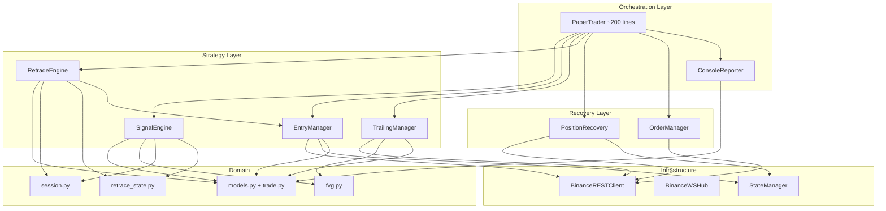

# Bot.py Refactoring Planı — `sniper/src/bot.py`

> **Tarih:** 2026-06-25
> **Dosya:** `sniper/src/bot.py` (~1,700 satır, 1 sınıf, 18 metot)
> **Durum:** God Object anti-pattern, 10+ FIX yaması, sıfır test, kopyala-yapıştır kod blokları

---

## 📊 Mevcut Durum Analizi

| Ölçüt | Değer |
|--------|-------|
| Satır sayısı | ~1,700 satır |
| Sınıf sayısı | 1 (`PaperTrader`) |
| Metot sayısı | 18 (7'si 80+ satır) |
| State sözlükleri | 7 adet (`states`, `rsms`, `rsms_retrade`, `active_trades`, `trades`, `_log_state`, `_stage`) |
| FIX yorumları | 10+ adet (#1 - #10) |
| Magic number | 12+ adet |
| İç içe try/except | 4 seviyeye kadar |
| Bağımlı modüller | 12 modül |
| Kopyala-yapıştır blok | LHR long/short ~80 satır, order id extraction 10+ yer |

---

## 🏗️ Hedef Mimari

```
sniper/src/
├── bot.py                    ← Orchestrator (~200 satır)
├── trading/
│   ├── __init__.py
│   ├── signal_engine.py      ← CBDR/Sweep/FVG sinyal akışı (~150 satır)
│   ├── entry_manager.py      ← Entry validation + order placement (~120 satır)
│   ├── trailing_manager.py   ← 1m FVG trailing + exit kontrolü (~100 satır)
│   ├── retrade_engine.py     ← Retrade sweep + LHR fallback (~150 satır)
│   ├── position_recovery.py  ← Recover + ghost reconciliation (~120 satır)
│   └── order_manager.py      ← _update_orders + _repair_protection (~80 satır)
├── models/
│   ├── trade.py              ← ActiveTrade, TradeResult dataclass'ları
│   └── events.py             ← SignalEvent, TradeEvent (observer pattern)
├── reporting/
│   └── console_reporter.py   ← _pl() + log formatlaması (~60 satır)
├── bot_binance.py            ← (mevcut, iyileştirilecek)
├── bot_infra.py              ← (mevcut, iyileştirilecek)
├── websocket.py              ← (mevcut)
├── config.py                 ← (mevcut, magic number'lar eklenecek)
├── models.py                 ← (mevcut)
├── fvg.py                    ← (mevcut)
├── retrace_state.py          ← (mevcut)
├── session.py                ← (bölünecek: SessionState + SessionTracker + TradeDayState)
└── state_manager.py          ← (mevcut)
```

### Bağımlılık Akışı



---

## 🔴 Problem Kataloğu & Çözüm Stratejisi

### P1 — God Object: PaperTrader

**Sorun:** Tüm iş mantığı tek sınıfta. 1,700 satır, 18 metot, 7 state dictionary.

**Çözüm:** Her sorumluluk alanı bağımsız bir sınıfa çıkarılacak:
- `SignalEngine` — `_on_15m_close()` sinyal akışı
- `EntryManager` — `_try_entry()` + order placement + PENDING kilidi
- `TrailingManager` — `_on_1m_close()` FVG trailing + exit kontrolü
- `RetradeEngine` — `_check_retrade()` + LHR fallback
- `PositionRecovery` — `_recover_positions()` + `_reconcile_ghost_positions()`
- `OrderManager` — `_update_orders()` + `_repair_protection()`

### P2 — Trade Sözlüğü (dict → dataclass)

**Sorun:** `active_trades[sym]` 15+ key'li raw dict. Tip güvenliği yok, key ismi yanlış yazılsa runtime'da patlar.

**Çözüm:**
```python
@dataclass
class ActiveTrade:
    symbol: str
    side: Literal["long", "short"]
    entry_price: float
    entry_bar_index: int
    sl: float
    tp: float
    qty: float
    initial_sl: float
    initial_tp: float
    risk_pts: float
    trailing_count: int = 0
    is_retrade: bool = False
    is_recovered: bool = False
    hybrid_mode: str | None = None
    sl_order_id: str = ""
    tp_order_id: str = ""
    # Runtime-only:
    exit_price: float | None = None
    exit_bar: int | None = None
    result: str | None = None
```

### P3 — SessionState Overload

**Sorun:** `SessionState` 25+ mutable alan. CBDR, session izleme, retrade ve trade counting birbirine karışmış.

**Çözüm:** 3 ayrı sınıf:
- `SessionState` — sadece CBDR body + bias + sweep
- `SessionTracker` — `london_high/low`, `asia_high/low`, `range_type`
- `TradeDayState` — `trades_today`, retrade armed/state

### P4 — LHR Fallback Kopyala-Yapıştır

**Sorun:** `_check_retrade()` içinde long ve short LHR blokları ~40'ar satır, %90 aynı kod.

**Çözüm:** `RetradeEngine._execute_lhr_entry(sym, side, current, atr_val, ss)` ortak metodu.

### P5 — Magic Numbers

**Sorun:** İş mantığı kritik sabitleri kod içinde gömülü.

**Çözüm:** Tümü `config.py`'ye taşınacak:

| Mevcut (inline) | config.py anahtarı |
|-----------------|-------------------|
| `LONDON_RETEST_PCT = 0.003` | `LHR_RETEST_PCT` |
| `WINDOW_15M = 500` | `RETRADE_SWEEP_WINDOW` |
| `0.3` (retrade min_fvg çarpanı) | `RETRADE_FVG_SIZE_MULT` |
| `0.5` (CBDR dead eşiği) | `CBDR_DEAD_THRESHOLD_PCT` |
| `0.2` (min trailing move çarpanı) | `TRAIL_MIN_MOVE_MULT` |
| `3` (retrade FVG max attempts) | `RETRADE_FVG_MAX_ATTEMPTS` |
| `0.1` (min risk dist ATR çarpanı) | `MIN_RISK_DIST_ATR_MULT` |
| `0.0001` (default ATR fallback) | `DEFAULT_ATR_FALLBACK_PCT` |
| `1.0` (LHR risk ATR çarpanı) | `LHR_RISK_ATR_MULT` |

### P6 — `_pl()` Print Karmaşası

**Sorun:** `_pl()` loglama + state dedup + print + format + separator hesaplama — hepsi bir arada.

**Çözüm:** `ConsoleReporter` sınıfı. Strategy katmanı sadece event yayar:
```python
class ConsoleReporter:
    def emit(self, event: SignalEvent | TradeEvent | SystemEvent) -> None: ...
```

### P7 — Sweep Tespiti Duplikasyonu

**Sorun:** `_check_retrade()` sweep tespit döngüsü ile `session.py:_check_cbdr_sweep()` aynı mantığı farklı implemente ediyor.

**Çözüm:** `trading/sweep_detector.py` ortak modülü.

### P8 — Hata Yönetimi

**Sorun:** 4 seviye iç içe try/except, hatalar sessizce yutuluyor, hangi katmanda ne olduğu belirsiz.

**Çözüm:**
- İç katman hataları yukarı fırlatır (let it crash)
- Sadece orchestrator (`PaperTrader.run()`) yakalar ve loglar
- `Result[T]` monad'ı opsiyonel (Faz 5)

### P9 — Async Anti-patterns

**Sorun:** `urllib.request` sync HTTP'yi `run_in_executor` ile sarmalama, `asyncio.gather` return_exceptions ile hata yutma.

**Çözüm:**
- `aiohttp` geçişi (Faz 5)
- `asyncio.TaskGroup` (Python 3.11+) ile structured concurrency

### P10 — Sıfır Test

**Sorun:** Hiç test yok. Her değişiklik canlıda risk.

**Çözüm:** Dependency injection ile her strateji sınıfı bağımsız test edilebilir:
```python
class SignalEngine:
    def __init__(self, state_factory, rsm_factory, config_provider): ...

def test_skip_on_neutral_bias():
    engine = SignalEngine(
        state_factory=lambda: mock_state(bias=DailyBias.NEUTRAL),
        ...
    )
    assert engine.evaluate(bars) == SignalDecision.SKIP
```

---

## 📅 Faz Planı

| Faz | Kapsam | Tahmini Süre | Risk | Bağımlılık |
|-----|--------|-------------|------|-----------|
| **Faz 0** | Quick wins: `_extract_order_id()`, LHR birleştirme, dupe fonksiyon temizliği | 2-4 saat | 🟢 Düşük | Yok |
| **Faz 1** | `ActiveTrade` dataclass, magic numbers → config, `_pl()` → ConsoleReporter | 1-2 gün | 🟢 Düşük | Faz 0 |
| **Faz 2** | `SignalEngine` + `EntryManager` ayrıştırması | 2-3 gün | 🟡 Orta | Faz 1 |
| **Faz 3** | `TrailingManager` + `RetradeEngine` ayrıştırması | 2-3 gün | 🟡 Orta | Faz 2 |
| **Faz 4** | `SessionState` bölme + sweep dedup merkezileştirme + `PositionRecovery` | 1-2 gün | 🟠 Orta-Yüksek | Faz 2 |
| **Faz 5** | `aiohttp` geçişi + hata yönetimi standardizasyonu + `OrderManager` | 2-3 gün | 🔴 Yüksek | Faz 3 |
| **Faz 6** | Test altyapısı + integration testleri | 2-3 gün | 🟡 Orta | Faz 5 |

---

## ⚡ Faz 0 — Hemen Uygulanabilir Quick Wins

Bunlar mevcut yapıyı bozmadan, risk almadan uygulanabilir:

1. **`_extract_order_id(resp)` yardımcısı**
   10+ yerde tekrar eden `resp.get("algoId") or resp.get("orderId") or resp.get("id") or ""` kalıbını `bot_infra.py`'ye `extract_order_id(resp: dict) -> str` olarak taşı.

2. **LHR long/short birleştirme**
   `_check_retrade()` içindeki ~80 satır kopyala-yapıştır LHR kodunu tek bir `_execute_lhr_entry(sym, side, ...)` metoduna çek.

3. **Fonksiyon duplikasyonu temizliği**
   `bot_binance.py`'deki `_round_to_tick`/`_round_step` ile `bot_infra.py`'dekiler aynı — birleştir, `bot_infra.py`'de kalsın.

4. **`__main__` bloğu ayrıştırması**
   `if __name__ == "__main__"` blogunu `main()` fonksiyonuna çıkar, `bot.py` sonunda sadece `main()` çağrısı kalsın.

5. **Logger yapılandırmasını `logging_setup.py`'ye taşı**
   İlk 60 satırdaki logger konfigürasyonu bot.py'yi kirletiyor.

---

## 🗺️ Uygulama Sırası (Önerilen)

```
Faz 0  →  Faz 1  →  Faz 2  →  Faz 3  →  Faz 4  →  Faz 5  →  Faz 6
(hemen)   (temel)   (çekirdek) (devam)   (domain)   (async)   (test)
```

Her faz sonunda:
- `python bot.py` çalışır durumda olmalı
- Log çıktıları öncekiyle birebir aynı olmalı (davranışsal regresyon yok)
- Paper trade simülasyonu aynı sinyalleri üretmeli

---

## 📝 Notlar

- Tüm değişiklikler **davranışsal olarak nötr** olmalı — strateji mantığında hiçbir değişiklik yapılmamalı.
- Her faz kendi başına merge edilebilir olmalı.
- `bot.py`'nin son hali ~200 satır saf orchestrator olmalı: başlatma, callback kaydı, event yönlendirme.
- Strateji sınıfları `PaperTrader`'a DI (dependency injection) ile verilmeli, doğrudan `self` üzerinden erişilmemeli.
