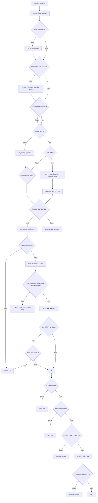
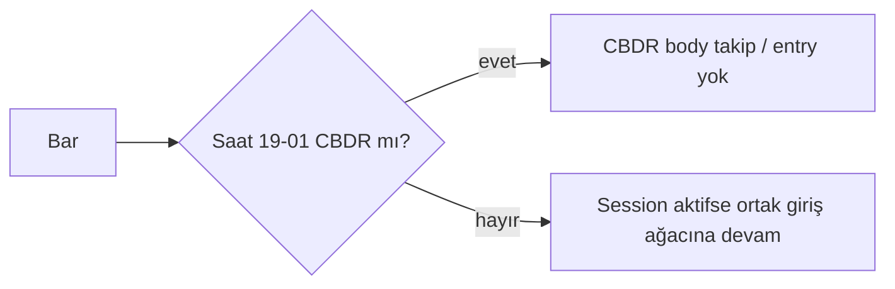

# Giriş Karar Ağacı Grafikleri

## Ortak canlı/backtest giriş ağacı

## Sembol bazlı session dalları

Karar ağacının geri kalanı tüm sembollerde aynıdır. Farklı olan yalnızca `CBDR start/end` değeridir.

### SOLUSDT

### BNBUSDT, ATOMUSDT, APTUSDT, DOTUSDT

### AVAXUSDT, XRPUSDT, ADAUSDT

### LINKUSDT

## Sembol matrisi

| Sembol | CBDR | Giriş için aktif dış pencere |
|---|---:|---|
| SOLUSDT | 19:00-01:00 | session router izin verirse |
| BNBUSDT | 19:00-01:00 | session router izin verirse |
| ATOMUSDT | 19:00-01:00 | session router izin verirse |
| APTUSDT | 19:00-01:00 | session router izin verirse |
| DOTUSDT | 19:00-01:00 | session router izin verirse |
| AVAXUSDT | 22:00-02:00 | 02:00-22:00 içindeki aktif session |
| XRPUSDT | 22:00-02:00 | 02:00-22:00 içindeki aktif session |
| ADAUSDT | 22:00-02:00 | 02:00-22:00 içindeki aktif session |
| LINKUSDT | 01:00-05:00 | 05:00-01:00 içindeki aktif session |

## Kritik not

Bu grafik sweep olmadan giriş akışını göstermiyor. Sweep yoksa RSM başlatılmaz, FVG taranmaz ve entry oluşmaz. TRIGGER_READY state'i yeni CBDR gününe taşınırsa parity kuralı gereği kilitsiz ve nötr durumda resetlenir.
